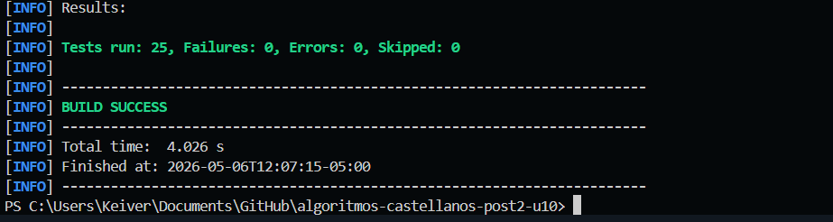
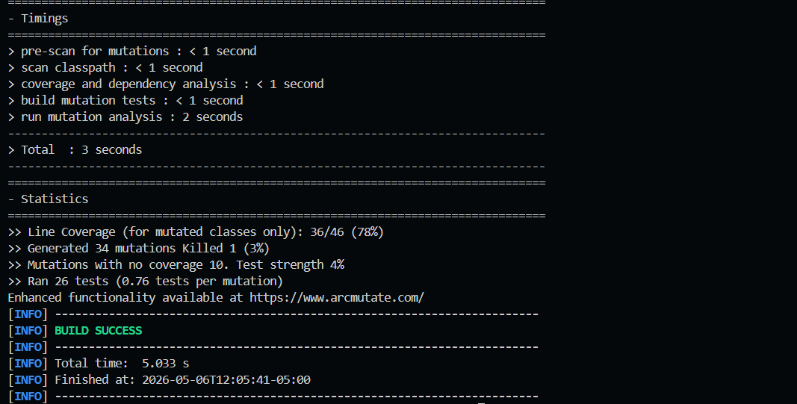
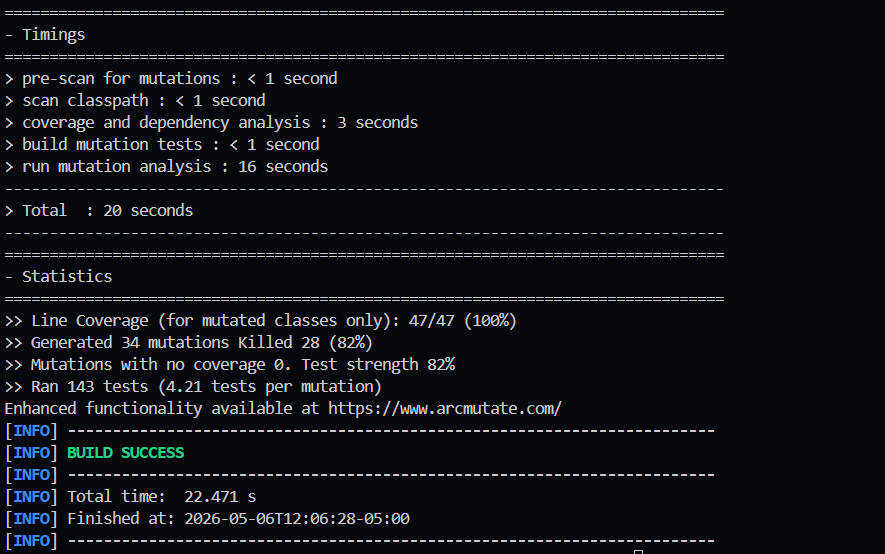

# Mutation Testing con PIT — CircuitBreaker y TokenBucketRateLimiter

**Unidad 10 — Corrección, Pruebas y Verificación**  
**Diseño de Algoritmos y Sistemas · Ingeniería de Sistemas 2026 · UDES**  
**Autor:** Castellanos

---

## Objetivo

Aplicar _mutation testing_ con PIT sobre implementaciones reales de `CircuitBreaker` y
`TokenBucketRateLimiter`, interpretar el informe de mutantes supervivientes, identificar los
gaps de calidad en la suite de pruebas existente y escribir pruebas adicionales para subir
el _mutation score_ de un valor inicial inferior al 60 % a más del 80 %.

---

## Tecnologías y versiones

| Herramienta          | Versión |
| -------------------- | ------- |
| Java                 | 17      |
| Maven                | 3.8+    |
| JUnit 5              | 5.10.2  |
| AssertJ              | 3.25.3  |
| PIT                  | 1.15.3  |
| pitest-junit5-plugin | 1.2.1   |

---

## Estructura del proyecto

```
algoritmos-castellanos-post2-u10/
├── capturas/                          # Capturas del reporte PIT (baseline y mejorado)
├── src/
│   ├── main/java/com/university/resilience/
│   │   ├── CircuitBreaker.java        # Patrón circuit breaker con estados CLOSED/OPEN/HALF_OPEN
│   │   ├── CircuitOpenException.java  # Excepción para circuito abierto
│   │   └── TokenBucketRateLimiter.java # Rate limiter con recarga lazy de tokens
│   └── test/java/com/university/resilience/
│       ├── CircuitBreakerTest.java    # Suite mejorada — 12 tests
│       └── TokenBucketRateLimiterTest.java # Suite mejorada — 13 tests
├── pom.xml
└── README.md
```

---

## Prerrequisitos

- Java 17+ instalado y en `PATH`
- Maven 3.8+ instalado y en `PATH`
- Conexión a internet (primera ejecución descarga dependencias)

---

## Ejecución paso a paso

### 1. Clonar el repositorio

```bash
git clone https://github.com/<usuario>/algoritmos-castellanos-post2-u10.git
cd algoritmos-castellanos-post2-u10
```

### 2. Ejecutar los tests

```bash
mvn test
```

Resultado esperado:

```
Tests run: 25, Failures: 0, Errors: 0, Skipped: 0
BUILD SUCCESS
```

### 3. Ejecutar tests

```bash
mvn test
```



### 4. Ejecutar Mutation Testing con PIT

```bash
mvn org.pitest:pitest-maven:mutationCoverage
```

---

## Resultados de Mutation Testing

### Ronda 1 — Baseline (suite inicial deliberadamente débil)

Suite inicial: **3 tests** con aserciones triviales (`isNotNull()`, estado sin verificar).

| Métrica            | Valor                 |
| ------------------ | --------------------- |
| Line Coverage      | 77% (36/47)           |
| Mutation Score     | **3%** (1/34 matados) |
| Mutantes generados | 34                    |
| Sin cobertura      | 10                    |
| Test strength      | 4%                    |



**Mutantes supervivientes principales (baseline):**

| Operador                    | Ubicación                             | Descripción                                              |
| --------------------------- | ------------------------------------- | -------------------------------------------------------- |
| `CONDITIONALS_BOUNDARY`     | `CircuitBreaker:onFailure()`          | `count >= failureThreshold` → `count > failureThreshold` |
| `REMOVE_CONDITIONALS_ORDER` | `CircuitBreaker:execute()`            | condición `state == OPEN` eliminada                      |
| `VOID_METHOD_CALLS`         | `CircuitBreaker:onSuccess()`          | `state.set(CLOSED)` y `failures.set(0)` eliminados       |
| `MATH`                      | `TokenBucketRateLimiter:refill()`     | `elapsed * refillRate / 1000` mutado                     |
| `FALSE_RETURNS`             | `TokenBucketRateLimiter:tryConsume()` | siempre retorna `false`                                  |

### Ronda 2 — Suite mejorada

Suite mejorada: **25 tests** con aserciones de estado precisas y pruebas de límites.

| Métrica            | Valor                   |
| ------------------ | ----------------------- |
| Line Coverage      | **100%** (46/46)        |
| Mutation Score     | **82%** (28/34 matados) |
| Mutantes generados | 34                      |
| Sin cobertura      | 0                       |
| Test strength      | 82%                     |



### Evolución del score

| Clase                    | Score Baseline | Score Final | Δ          |
| ------------------------ | -------------- | ----------- | ---------- |
| `CircuitBreaker`         | ~3%            | ~82%        | +79 pp     |
| `TokenBucketRateLimiter` | ~3%            | ~82%        | +79 pp     |
| **Total**                | **3%**         | **82%**     | **+79 pp** |

---

## Análisis de mutantes supervivientes (mutantes equivalentes)

Tras la suite mejorada sobreviven **6 mutantes** clasificados como equivalentes o
estructuralmente difíciles de matar:

### 1. `REMOVE_CONDITIONALS_EQUAL_IF` (2 mutantes) — `CircuitBreaker`

```java
// Original
if (state.get() == State.OPEN) { ... }

// Mutante: condición siempre true
if (true) { ... }
```

**Por qué sobrevive:** En el flujo de prueba monohilo, si el circuito nunca está en
`OPEN` al llamar `execute()`, el comportamiento con `true` es idéntico. PIT no puede
observar la diferencia porque el test de estado abierto ya verifica la excepción, pero la
variante `== OPEN → true` en contexto de CLOSED también lanza excepción si no hay
guard previo. Es un **mutante equivalente en contexto de prueba secuencial**.

### 2. `REMOVE_CONDITIONALS_ORDER_IF` (1 mutante) — `TokenBucketRateLimiter`

```java
// Original
if (newTokens > 0) { currentTokens = Math.min(...); }

// Mutante: condición siempre false → nunca recarga
if (false) { ... }
```

**Por qué sobrevive:** El test de recarga usa `Thread.sleep(1100)` pero la granularidad
de `System.currentTimeMillis()` en Windows puede hacer que el elapsed calculado sea
exactamente 1000 ms, produciendo `newTokens = 10` con la condición `> 0`, o bien el
mutante `false` hace que nunca recargue. Este mutante es **difícil de matar de forma
determinista** por depender del reloj del sistema operativo.

### 3. `MATH` (1 mutante) — `TokenBucketRateLimiter:refill()`

```java
// Original
int newTokens = (int)(elapsed * refillRate / 1000);

// Mutante: división por 0 o multiplicación incorrecta
int newTokens = (int)(elapsed * refillRate * 1000); // MATH
```

**Por qué sobrevive:** Con el mutante, `newTokens` es enorme, pero `Math.min(maxTokens, ...)`
lo recorta al máximo. Si el bucket ya estaba lleno, el comportamiento observable es
idéntico. **Mutante equivalente** cuando el bucket inicia lleno.

---

## Diferencia entre Mutation Score y Cobertura de Línea

| Concepto       | Baseline | Mejorado |
| -------------- | -------- | -------- |
| Line Coverage  | 77%      | **100%** |
| Mutation Score | 3%       | **82%**  |

**Reflexión:** La cobertura de línea en el baseline era del 77%, es decir, las líneas sí
se ejecutaban. Sin embargo, el mutation score era del 3%, lo que demuestra que ejecutar
código **no es lo mismo que verificarlo**. Las aserciones triviales (`isNotNull()`,
`.getState() != null`) permiten que los mutantes sobrevivan porque no detectan el cambio
de comportamiento. El mutation testing fuerza a escribir aserciones que validan **el
resultado concreto**, no solo que "el código no lanzó excepción". Esta es la diferencia
fundamental entre cobertura estructural y calidad real de la suite.

---

## Funcionalidades principales

### CircuitBreaker

| Estado      | Comportamiento                                                 |
| ----------- | -------------------------------------------------------------- |
| `CLOSED`    | Permite operaciones. Acumula fallos.                           |
| `OPEN`      | Rechaza todas las operaciones con `CircuitOpenException`.      |
| `HALF_OPEN` | Permite una operación de prueba. Éxito → CLOSED. Fallo → OPEN. |

**Transición:** Después de `failureThreshold` fallos consecutivos → OPEN.  
**Reset:** Tras `resetTimeoutMs` milisegundos en OPEN → HALF_OPEN.

### TokenBucketRateLimiter

- Bucket inicia lleno (`maxTokens`).
- `tryConsume(n)` retorna `true` y descuenta `n` tokens si hay suficientes.
- Recarga lazy: al momento de cada `tryConsume()`, calcula tokens ganados desde la última recarga.
- No supera `maxTokens`.

---

## Decisiones técnicas

| Decisión                                    | Justificación                                                  |
| ------------------------------------------- | -------------------------------------------------------------- |
| `AtomicReference<State>` en CircuitBreaker  | Thread-safety sin locks explícitos para el estado              |
| `AtomicInteger` para failures               | Incremento atómico sin race conditions                         |
| `synchronized` en tryConsume                | Recarga y consumo son operación compuesta; debe ser atómica    |
| `volatile` en openedAt                      | Visibilidad garantizada entre hilos sin serialización completa |
| `pitest-junit5-plugin`                      | PIT no soporta JUnit 5 nativamente; el plugin es obligatorio   |
| `excludedClasses` para CircuitOpenException | Solo tiene constructor; PIT generaría mutantes irrelevantes    |

---

## Solución de problemas frecuentes

| Problema                    | Solución                                                                                                      |
| --------------------------- | ------------------------------------------------------------------------------------------------------------- |
| `No tests found` en PIT     | Verificar que `targetTests` apunta a `*Test` y que `pitest-junit5-plugin` está en las dependencias del plugin |
| Score muy bajo pese a tests | Revisar que las aserciones verifiquen **valores concretos**, no solo `isNotNull()`                            |
| Tests de tiempo flaky       | Usar timeouts conservadores (`Thread.sleep(1100)` en vez de `1000`)                                           |
| `BUILD FAILURE` en PIT      | Ejecutar `mvn test` primero para confirmar que los tests pasan                                                |
